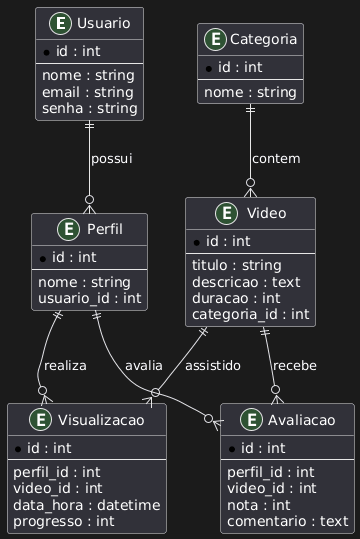

# Streaming_Project

# poo_trabalho_jdbc

## Equipe

| Equipe    | Email                  |
|-----------|-----------------------|
| Anderson  | andersonlsoliveira02@gmail.com    |
| Vitor Morini  |     |

## Configurações

| Item           | Valor                  |
|----------------|----------------------|
| Banco de Dados | MySQL                 |
| Schema         | StreamingProject      |

## Diagrama de classe da UML

*Diagrama representando as classes do projeto (Usuario, Perfil, Video, Categoria, Visualizacao, Avaliacao)*  


## Diagrama MER

*Diagrama representando o relacionamento das tabelas no banco de dados*  



## Instruções SQL

### Criação do schema e tabelas

```sql
CREATE DATABASE IF NOT EXISTS StreamingProject;
USE StreamingProject;

-- Usuário
CREATE TABLE Usuario (
    id INT AUTO_INCREMENT PRIMARY KEY,
    nome VARCHAR(100) NOT NULL,
    email VARCHAR(100) NOT NULL UNIQUE,
    senha VARCHAR(100) NOT NULL
);

-- Perfil (um usuário pode ter vários perfis)
CREATE TABLE Perfil (
    id INT AUTO_INCREMENT PRIMARY KEY,
    nome VARCHAR(100) NOT NULL,
    usuario_id INT NOT NULL,
    FOREIGN KEY (usuario_id) REFERENCES Usuario(id)
);

-- Categoria (um vídeo pertence a uma categoria)
CREATE TABLE Categoria (
    id INT AUTO_INCREMENT PRIMARY KEY,
    nome VARCHAR(100) NOT NULL
);

-- Vídeo
CREATE TABLE Video (
    id INT AUTO_INCREMENT PRIMARY KEY,
    titulo VARCHAR(200) NOT NULL,
    descricao TEXT,
    duracao INT NOT NULL,
    categoria_id INT NOT NULL,
    FOREIGN KEY (categoria_id) REFERENCES Categoria(id)
);

-- Visualização (relaciona Perfil x Vídeo, com atributos extras)
CREATE TABLE Visualizacao (
    id INT AUTO_INCREMENT PRIMARY KEY,
    perfil_id INT NOT NULL,
    video_id INT NOT NULL,
    data_hora DATETIME NOT NULL,
    progresso INT,
    FOREIGN KEY (perfil_id) REFERENCES Perfil(id),
    FOREIGN KEY (video_id) REFERENCES Video(id)
);

-- Avaliação (relaciona Perfil x Vídeo, com atributos extras)
CREATE TABLE Avaliacao (
    id INT AUTO_INCREMENT PRIMARY KEY,
    perfil_id INT NOT NULL,
    video_id INT NOT NULL,
    nota INT CHECK (nota BETWEEN 1 AND 5),
    comentario TEXT,
    FOREIGN KEY (perfil_id) REFERENCES Perfil(id),
    FOREIGN KEY (video_id) REFERENCES Video(id)
);

### Exemplo de inserções

-- Usuários
INSERT INTO Usuario (nome, email, senha) VALUES
('Anderson Silva', 'anderson@email.com', 'senha123'),
('Mariana Costa', 'mariana@email.com', 'senha456');

-- Perfis
INSERT INTO Perfil (nome, usuario_id) VALUES
('Anderson - Pessoal', 1),
('Mariana - Principal', 2);

-- Categorias
INSERT INTO Categoria (nome) VALUES
('Ação'),
('Comédia');

-- Vídeos
INSERT INTO Video (titulo, descricao, duracao, categoria_id) VALUES
('Missão Explosiva', 'Agente especial tenta impedir ataque terrorista.', 125, 1),
('Rir é o Melhor Remédio', 'Stand-up de humor ácido.', 90, 2);

-- Visualizações
INSERT INTO Visualizacao (perfil_id, video_id, data_hora, progresso) VALUES
(1, 1, '2025-09-01 20:15:00', 60),
(2, 2, '2025-09-03 18:30:00', 50);

-- Avaliações
INSERT INTO Avaliacao (perfil_id, video_id, nota, comentario) VALUES
(1, 1, 5, 'Filme incrível, cheio de ação.'),
(2, 2, 4, 'Stand-up divertido.');

