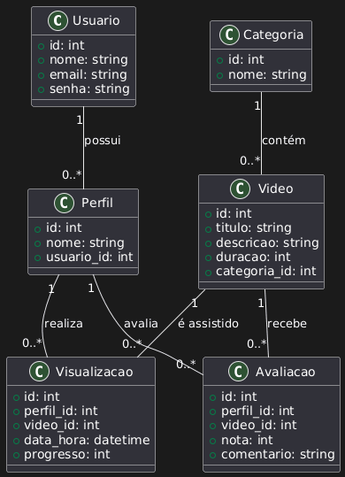

# Streaming_Project

# poo_trabalho_jdbc

## Equipe

| Equipe    | Email                  |
|-----------|-----------------------|
| Anderson  | andersonlsoliveira02@email.com    |
| Vitor Morini  |     |

## Configurações

| Item           | Valor                  |
|----------------|----------------------|
| Banco de Dados | MySQL                 |
| Schema         | StreamingProject      |

## Diagrama de classe da UML

*Diagrama representando as classes do projeto (Usuario, Perfil, Video, Categoria, Visualizacao, Avaliacao)*  



## Diagrama MER

*Diagrama representando o relacionamento das tabelas no banco de dados*  


## Instruções SQL

### Criação do schema e tabelas

```sql
-- Aqui entra todo o SQL de criação de tabelas
## Instruções SQL

### Criação do schema e tabelas

```sql
-- Criação do schema
CREATE DATABASE IF NOT EXISTS StreamingProject;
USE StreamingProject;

-- Tabela USUARIO
CREATE TABLE IF NOT EXISTS Usuario (
    id INT AUTO_INCREMENT PRIMARY KEY,
    nome VARCHAR(100) NOT NULL,
    email VARCHAR(100) NOT NULL UNIQUE,
    senha VARCHAR(100) NOT NULL
);

-- Tabela VIDEO
CREATE TABLE IF NOT EXISTS Video (
    id INT AUTO_INCREMENT PRIMARY KEY,
    titulo VARCHAR(200) NOT NULL,
    descricao TEXT,
    duracao INT NOT NULL
);

-- Tabela VISUALIZACAO
CREATE TABLE IF NOT EXISTS Visualizacao (
    id INT AUTO_INCREMENT PRIMARY KEY,
    perfil_id INT NOT NULL,
    video_id INT NOT NULL,
    data_hora DATETIME NOT NULL,
    progresso INT
);


-- Inserção de usuários
INSERT INTO Usuario (nome, email, senha) VALUES 
('Anderson Silva', 'anderson@email.com', 'senha123'),
('Mariana Costa', 'mariana@email.com', 'senha456');

-- Inserção de vídeos
INSERT INTO Video (titulo, descricao, duracao) VALUES
('Missão Explosiva', 'Agente especial tenta impedir ataque terrorista.', 125),
('Rir é o Melhor Remédio', 'Stand-up de humor ácido.', 90);

-- Inserção de visualizações
INSERT INTO Visualizacao (perfil_id, video_id, data_hora, progresso) VALUES
(1, 1, '2025-09-01 20:15:00', 60),
(2, 2, '2025-09-03 18:30:00', 50);
